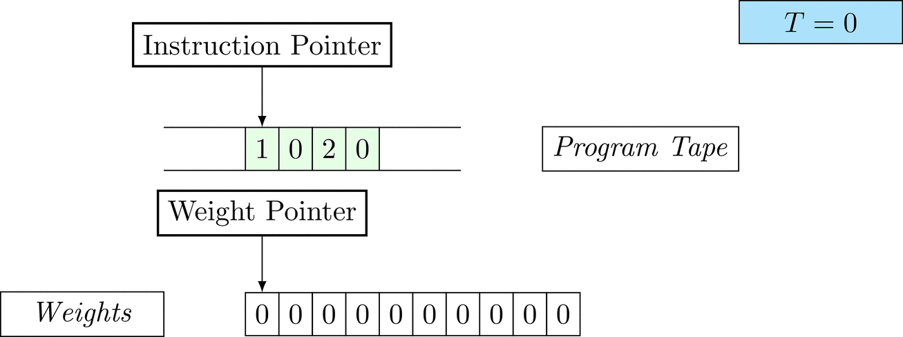
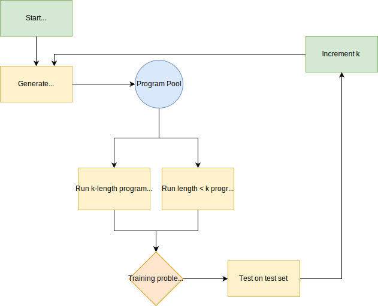

This will be a two-part blog series, where the first part reproduces the experiments of the paper "Discovering neural nets with low Kolmogorov complexity" and the second part expands on the results of the paper. 



In this part, we spotlight the paper and give an introduction to algorithmic complexity theory. The code used to reproduce the paper is available on GitHub.

<!-- more -->


## Table of contents

{: class="table-of-content"}
* TOC
{:toc}

## 1. Introduction

The repository coupled to this blog contains a Python implementation of the paper:

> Discovering neural nets with low Kolmogorov complexity and high generalization capacity. Jürgen Schmidhuber, 1997.

According to Google Scholar, this paper has 140 citations. 
The paper contains an array of interesting ideas and the authors have published several followup papers. The rest of this first blog post will explain and expore the content of this paper.

The paper provides an interesting perspective. The approach taken is quite different from the gradient-based learning that is (not undeservingly) the main focus of machine learning today. Still, it opens the door to better understanding of the scope of the task that researchers in field of machine learning (and in the broader sense, artificial intelligence) have set themselves. 

The work accompanying the paper, mainly performed during the 1990s, was performed on systems with much more limited computing power (SUN SPAC ELC, 64MB RAM). 
Perhaps, with our modern hardware, we can extend the results of the original work. We hope that this repository will serve as both a learning experience for us and for the readers. 

We will not follow every detail of the paper explicitly, but will remain as close as we can.

The work provides a convenient bridge between machine learning and theoretical computer science (the Kolmogorov complexity components). 

This blog post has the following structure. First, some background on theoretical concepts needed understand the paper's position in the literature. 
Section three will summarize the approach taken in the paper, while the fourth section applies the approach two tasks described in the original paper. 
Finally, the fifth section sums up the insights and puts them into perspective.

Contributions:

- We spotlight an older paper in order to give an introduction into the field of algorithmic complexity.
- We extend the results of the original paper with more difficult tasks
- We explore the structure of program space
- We emphasized reproducibility. Our code is available at GitHub.


The second blog post will expand upon the first one and investigate how hard it really is to solve the famous FizzBuzz programming task. For any programmer, this should be an easy program to write. How hard is it for the approach taken here?

## 2. Algorithmic Complexity
First, an introduction to the concept of Kolmogorov complexity (K-Complexity). 
We will be aiming to find parameterizations of machine learning models with a low K-Complexity. 
What do we mean by this?

### Kolmogorov Complexity
Consider a sequence of 0s and 1s, that stretches for _n_ positions, drawn from the distribution of all such possible sequences. 
Could we, given this sequence, decide whether we have happened to obtain a special or ordinary sequence? 
In order to decide this, we have to make assumptions about the process that is generating our sequences. 
In the traditional statistical frameworks, we would assume that in each spot 0 and a 1 have some probability of appearing. 
For simplicity, let us consider the case where 0 and 1 are equally likely, in each of the _n_ positions, and _n_ is equal to 8.

> Sequence 1
>
> $$0 0 1 0 1 1 0 1$$
> 
> Sequence 2
> 
> $$0 1 0 1 0 1 0 1$$
> 

Now, for both sequences we can find the probability of generating this sequence given our model: this probability will be $$0.5^8$$. 
But this is not fully satisfying: we see that our model assigns the same probability to these two sequences, while the second sequence clearly contains some sort of regularity. 
Intuitively, something is different in the second sequence. 
If we were asked to memorize the two sequences, the second sequences would be easy to memorize: a sequence that consists of four times the subsequence '0 1'. 
The first sequence would require more room to specify completely. 


This notion of complexity is the algorithmic complexity, or Kolmogorov complexity. 
The algorithmic complexity of an object is equal to the length of the shortest program that produces the object. 
In this case, the object is a string and in most cases, the program is a set of instructions that can be run on some sort of Turing Machine. 

Algorithmic complexity is a major component of Solomonoff's theory of inference: this is a mathematical framework that is concerned with how to predict, given a set of symbols, the next symbol. 
In effect, it is a formalization of the scientific method: how do we decide which hypothesis is most likely correct given some data points? 
In Solomonoff's theory, we use the universal prior to decide which hypothesis is most likely: it will be the hypothesis described by the shortest program that fits the data. 

The notion of algorithmic complexity is in some specific sense independent of the language of symbols used to specify a specific program. 
This is because one can give a fixed set of instructions describing how to convert one language to another, which is to say, compile languages into one another. 
So the algorithmic complexity is independent of implementation details, up to a factor that describes cross-compilation (the constant factor is related to the probability of guessing a compiler). 
This is called the invariance theorem in Kolmogorov complexity. 
This however is a theoretical optimality, and in practice the instruction set can of course definitely influence the structure of the program search space in a meaningful way.

If you want to know more about this field of study: the following book contains everything you have ever wanted to know (and probably more): [Introduction to Kolmogorov Complexity and its Applications](https://www.springer.com/gp/book/9781489984456).

### Levin Search
In Solomonoff induction, we are required to enumerate all possible programs (hypotheses about the data), but it is here that we run into a problem: we cannot know whether a program will halt in general without waiting for it to halt, which could take forever.

Because of this difficulty, Leonid Levin came up with an approximate version of Solomonoff induction, and this procedure is named Levin Search (1973a, 1973b). 
In essence, it is Solomonoff's procedure, but with bounded resources. 
We simply start with all length 1 programs, and run them for a specified time. 
In the next phase, we run all length 2 programs for a specified time, and we again run the length 1 programs, but for a longer time. 
The relationship between the phase, or iteration $$i$$ and the length ($$l$$) of the program $$p$$ is as follows: 
 
$$2^i * 2^{-l(p)}$$

So in every iteration, we run longer programs for a comparatively short time, and shorter programs for a comparatively long time. 
As our universal prior indicates that these shorter programs have a higher probability of being the true data generating process, we spend more time on running shorter programs in the long run.

## 3. Solving Tasks with Levin Search

Now that the general concepts are out of the way, let us get to the meat of the paper. 
The researchers use a model of a universal computer to specify the weights for a neural network (actually in this particular paper, there is only one linear layer, with no activation, so the model is very similar to linear regression.)

We will be searching over programs that specify a weight vector, which we will load onto the net architecture. 
We will then test whether the resulting model is right about the training examples.

To obtain intuition for the Levin Search process, consider this example:
The task is to count the number of inputs to the model. 
In this case, the model has the following form:
A linear layer with 100 inputs units, one output unit and 100 weights receives 100-dimensional binary input vectors.
$$x_i$$ denotes the vector at dimension $$i$$, where $$0 <= i < 100$$. 
The networks output for a single input is given by $$ y = w_i x_i $$.

Further on, we will see that Figure 1 below is a program that prints the right solution for this task.
We will be work to understanding why and how in between.


_Figure 1: An animation of the universal computer used in this work. At each time step (counted in the upper right corner), the operation referenced by the instruction pointer is executed on the program tape (green). Note that the number of weights is set to 10 for all programs in order to generate compact animations._

There is only one solution that solves the task for every possible combination: each weight  $$ w_i = 1 $$.
To learn the task, three training examples (e.g. pairs of 100-dimensional binary input vectors with their associated count) are given.
Gradient descent will have a very hard time finding a generalizable solution, as only the weights of the corresponding inputs will receive any gradient.

### Universal Computer
Now we know what our program-generated model is supposed to do. 
How are we supposed to write a program? 
What operations are we allowed to use?
The universal computer used in the paper can utilize 13 different primitive instructions.
Together, these can compute any arbitrary function (note that this does not give us any guarantees about whether we will be able to find these functions!). 
The machine has an instruction pointer that can point to a certain address. 

### Initial Primitives

This is the list of possible instructions:

| No.  	    | Name 	        | No. Args	| Description |
|-----------|---------------|-----------|-------------|
| 0		  	| JUMPLEQ	 	| 3		    | If Value in `Address 1` <= Value in `Address 2`, Jump to `Address 3` |
| 1			| OUTPUT		| 1			| Write the contents of `Address 1`  to output
| 2			| JUMP	        | 1			| Jump to `Address 1`
| 3			| STOP	        | 0			| Halt
| 4			| ADD			| 3		    | The sum of contents of `Address 1` and `Address 2` is written to `Address 3`
| 5			| GET_INPUT		| 2		    | Get the (`Address 1`)-th value of input and write to `Address 2`
| 6			| MOVE		    | 2			| Copy contents of `Address 1` to `Address 2`
| 7			| ALLOCATE		| 1		    | Allocate (`Content 1`) new memory addresses
| 8			| INCREMENT	    | 1			| (`Address 1`) + 1
| 9			| DECREMENT		| 1			| (`Address 1`) - 1
| 10		| SUBTRACT		| 3			| The subtraction of `Address 1` from `Address 2` is written to `Address 3`
| 11		| MULTIPLY		| 3			| The product of contents of `Address 1` and `Address 2` is written to `Address 3`
| 12		| FREE			| 1			| Free / Deallocate (`Content 1`)  memory addresses

_Table 1: the primitive set used in the paper._

Some restrictions apply to the arguments of each primitive. 
In general, arguments that are allowed are _syntactically valid_.
For example, ALLOCATE is allowed to allocate 1 to 5 work tape cells at one, with a maximum that is prespecified for the universal computer. Allocating 6 cells at once would be syntactically invalid.

### Revisiting the invariance theorem
Evidently, the choice of primitives affects when we find a solution using Levin search.
We can see that the selection of primitives impacts the search by a constant factors through what the paper calls the compiler theorem and we previously introduced as the invariance theorem in Kolmogorov complexity.
In the context of universal machines, this result was described by Alan Turing in 1936:

> "It is possible to invent a single machine which can be used to compute any computable sequence. If this machine $$\mathcal{U}$$ is supplied with a tape on the beginning of which is written the S.D ["standard description" of an action table] of some computing machine $$\mathcal{M}$$, then $$\mathcal{U}$$  will compute the same sequence as $$\mathcal{M}$$ " [Turing1936]

### Program generation
Levin search is used to generate programs for the machine, that are then executed until halted.
Halting may occur by the `stop` operation, but also at a myriad of errors, including violating syntactical correctness.
After the program is halted, then the generated weights are used to generate solutions for the training set.
Only if all training examples match the generated solutions, the solution is used on the test set.



_Figure 2: Schematic version of the Levin Search process._

Whereas the paper describes a probabilistic variant of Levin Search, we choose to adopt the deterministic variant described by Norbert Jankowski in 1995 (who worked out this idea from Schmidhuber at the time). 
Schmidhuber reports that very similar results to that of the paper were found using systematic enumeration and that it is the preferred method when speed is an issue.

We will now walk through how deterministic Levin Search finds the solution for the counting task:



Hence we demonstrated step-by-step how Levin Search finds a solution given a task, in this case counting inputs.

Two very similar solutions were found, [1 0 2 0] and [1 1 2 0]. 

Let us examine the first (as shown before in Figure 1): 

| Address | Contents | Interpretation |
|---------|----------|----------------|
| 0		  | 1		 | OUTPUT		  |
| 1		  | 0		 | address 		  |
| 2		  | 2		 | JUMP			  |
| 3		  | 0		 | address		  |

_Table 2: A solution to the count inputs task (see the [experiments section](#counting-inputs) for a visualisation of the program's execution)._

The above is a program that sets all weights to 1. 
Try to see if you understand how the instructions on the tape correspond to what is happening in the animation.


The Kolmogorov complexity of the solution is small. 
The runtime of the solution is 201 time steps.

### Metrics

For each program, we will show a few metrics:

- _Program length_: the length of the program tape.
- _Space probability_: the space probability is the chance of guessing the program tape.
- _Runtime_: the number of time steps used by the program to terminate. Each operation (a primitive together with it's arguments) takes one time step.
- _Complexity_: the complexity is $$ |\text{program}| + log(\text{time steps to find the solution}) $$. The Levin complexity is the minimal value of this. For clarity, this complexity is conditional on the task.

For the space probability, we consider all programs that halted.
Programs that have a certain length, but do not finish in the first phase that they show up in, still have the space probability of the first time they show up. 
As an example: if a program has length 8, but is only recognized as a solution after the runtime increase in phase 9, it gets the space probability of an 8-length program. 

We also report search-dependent program statistics: the number of programs evaluated before finding the program and the allocated time steps. 
The number of programs searched before the program is found can be influenced by the order of the primitives in the search.

## 4. Experiments and Results
We have reimplemented two experiments from the original paper. 
We find the same solutions as the original authors did, ensuring that our implementation is effective.

All experiments are configured with a maximum work tape size to 10. 
Increasing this parameter, e.g. to the 1000 in the paper results in an explosion of the search paper for higher values of $$k$$. This is an implementation choice that we made to limit search time. 

The paper describes two tasks: counting inputs and adding input positions. 
For each task, we will give some information about the search process. 
We encourage you to compare the static programs to the dynamic GIFs to ensure that you understand how the generated program produces its solution.

Only three training examples are used for all tasks.
If a program matches ALL training examples, we check if the solution generalized to the test examples (the full solution). 

### Counting inputs
The first task is the counting of inputs, that we discussed earlier. 
The program has to put all the neural network weights to 1. 
With a search limit of length 4 problems ($$k=4$$), we find two solutions. 


    
### Add Input Positions

The second task is adding the input positions. 
That is, there will be some input positions that have _on_-bits, and the network has to give back the sum of the indices of these non-zero positions. 
The only solution to the problem is to make all weights $$w_i = i$$.
Deterministic Levin Search finds only the elegant solution mentioned in the paper.

The paper starts indexing from 0 (offset), whereas we index from 1 (count).
This choice has nothing to do with our position in the debate on this topic.
Conversely, redefining the task (and later weight primitives) is a preparation for the FizzBuzz task in next post.



Note that [7, 1, 8, -1, 1, -1, 2, 0] is also a valid program if the work tape size >= 100, which is found in section 4.5 of the paper. 
It unnecessarily allocates 100 cells on the work tape, hence we do not mind the fact that solution is not found as Levin Search discovers the nearly identical but more memory-efficient program above. 

### Different primitives
Evidently, the choice of primitives affects the point at which a solution is discovered. 
In the last experiment in the paper, another set of primitives is chosen and the previous experiment is repeated.
Specifically, the instructions `output` and `get_input` are superseded by `write_weight` and `read_weight`, allowing  interaction with the environment.

| No.  	    | Name 	        | No. Args	| Description |
|-----------|---------------|-----------|-------------|
| 1			| WRITE_WEIGHT	| 2			| Write the contents of `Address 1`  to $$\text{weight}_i$$, where $$i$$ is found in `Address 2`
| 5			| READ_WEIGHT	| 2		    | Read the contents of $$\text{weight}_i$$ and write it to the value found in `Address 2`

Remember that these primitives address the weights array in a count-based manner (i.e. starting at 1).



## 5. Discussion 

The Kolmogorov complexity and Levin Search are elegant and powerful concepts, that help us find and understand optimal solutions to tasks. 
However, as we have seen here, the search space of possible programs is immensely large. 

The structure of the search space is influenced by the set of primitives chosen to represent the underlying machine architecture. 
If a program calls for a specific subprogram, but that subprogram is hard to find, it might be fruitful to add that subprogram to the set of primitives. 
This is similar to what has happened to the [x86 instruction set](https://en.wikipedia.org/wiki/X86_instruction_listings) over time: instructions were added to make often-used operations more accessible. 
This is also what happens to programming languages over time: new language constructs are introduced to make previously hard to write programs easier to write. 

Here, the programs generated a set of weights for a neural network. However, the principle applies to the generation of any integer vector, as we will see in the follow-up to this blog post.


Our work can be seen as a reproduction of the paper, up to a certain point. We deviate in the following cases: 

- We give the programs more runtime in each phase, perhaps marking programs as solutions earlier. This has no bearing on the eventual length of the programs (the approximation of their Kolmogorov complexity.)

- The exact formula's for some metrics used in both papers are shrouded in mystery. Illustrated by the reported _complexity_ by Jankowski. The first example in the paper has a reported complexity of 18.0008. This number appears to be sum of the length of the program and the number of time steps required to print the solution. Readers that are able to reproduce the results are invited to contact us.

Another strange thing is that the levin search is deterministic and hence regardless of task enumerates the same problems. In the future, it might make sense to move away from Levin search precisely, and adaptively choose primitive probabilities. A version of this was explored in Wiering and Schmidhuber (1996).

We hope to see you at our next blog post:

- [Part 2: curriculum learning (Elman 1993, Bengio 2009)](2020-04-01-searching-for-neural-networks-with-low-kolmogorov-complexity.md)


## Attribution

Cited as:
```bibtex
@article{authors2020title,
  title   = "Searching for Neural Networks with Low Kolmogorov Complexity",
  author  = "Piepenbrock, Jelle and Brugman, Simon",
  journal = "simonbrugman.nl",
  year    = "2020",
  url     = "https://simonbrugman.nl/title"
}
```

This blog post was written as a collaboration between Simon Brugman and Jelle Piepenbrock (with equal contribution).
It was cross-published at both author's blogs. You can find the parallel version [here](#).

## References
- Turing, A. M. (1936). On computable numbers, with an application to the Entscheidungsproblem. J. of Math, 58(345-363), 5.
- Levin, L. A. (1973a). Universal sequential search problems. Problems of Information Transmission, 9(3):265--266.
- Levin, L. A. (1973b). On the notion of a random sequence. In Soviet. Math. Dokl. (Vol. 14, No. 5, pp. 1413-1416). [link](https://www.cs.bu.edu/fac/lnd/dvi/ran72.pdf)
- Levin, L. A. (1984). Randomness Conservation Inequalities: Information and Independence in Mathematical Theories. Information and Control, 61:15-37.
- Jankowski, N. (1995). Applications of Levin’s universal optimal search algorithm. System modeling control, 95, 34-40.
- Wiering, M. A., & Schmidhuber, J. (1996). Solving POMDPs with Levin Search and EIRA. In Machine Learning: Proceedings of the thirteenth International Conference (p. 534). Kaufmann.
- Schmidhuber, J. (1997). Discovering neural nets with low Kolmogorov complexity and high generalization capability. Neural Networks, 10(5), 857-873.
- Gagliolo, M. (2007). Universal search. Scholarpedia, 2(11), 2575.
