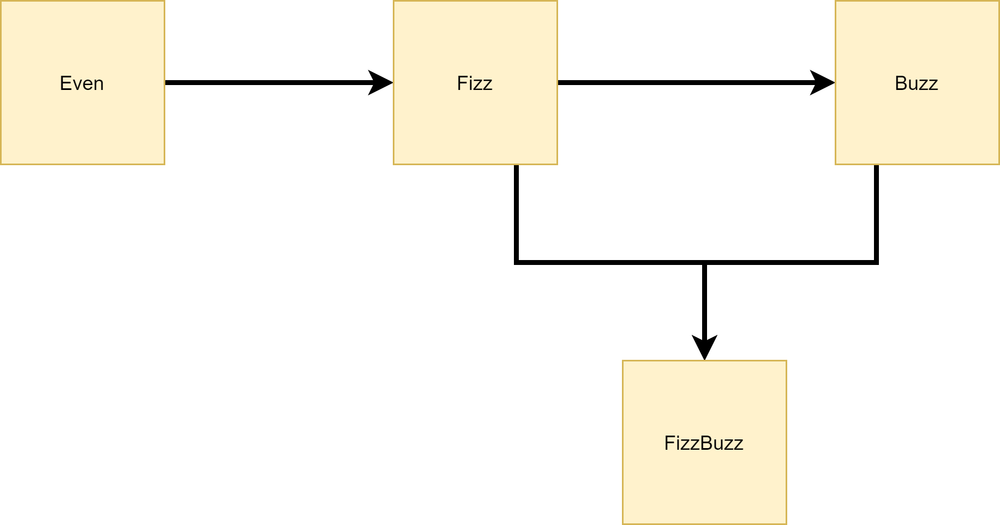
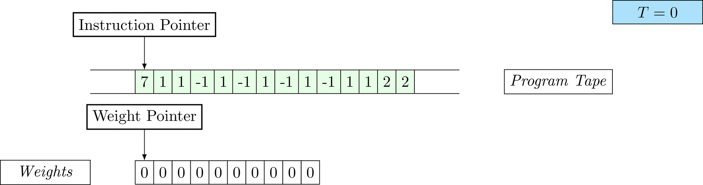
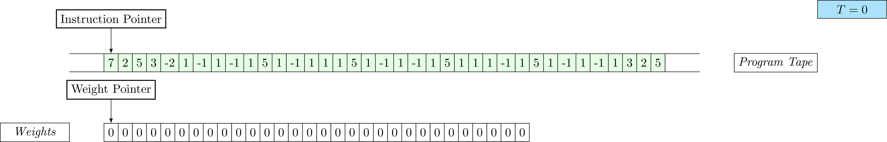
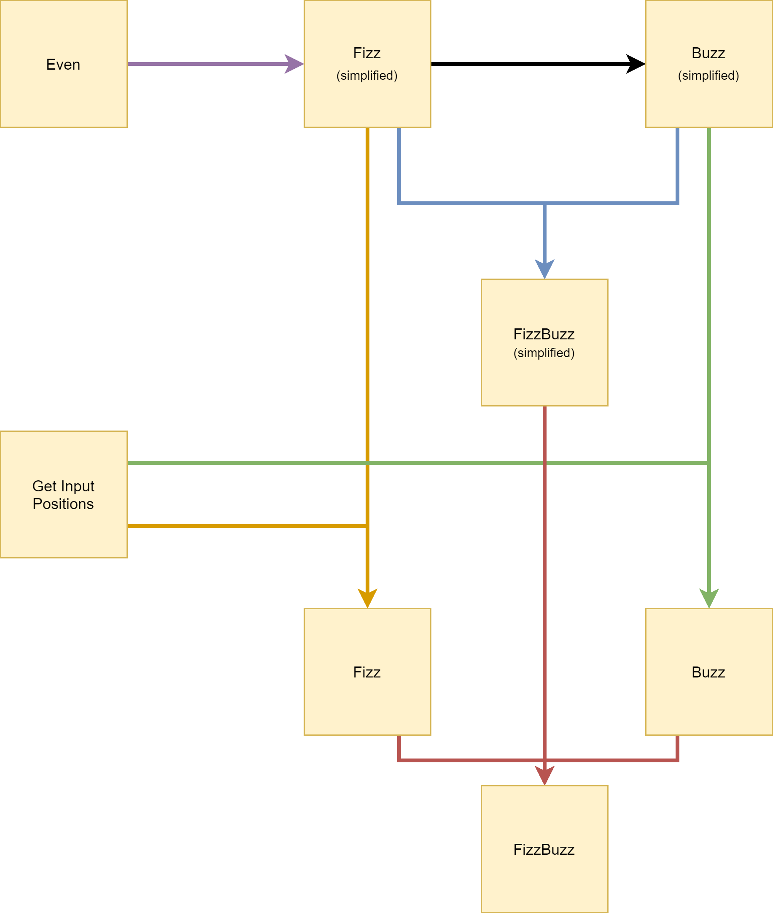
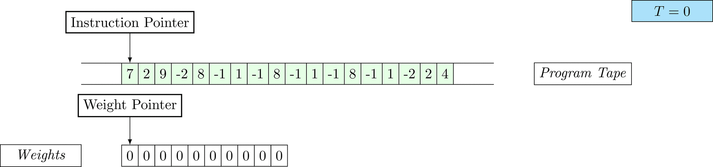
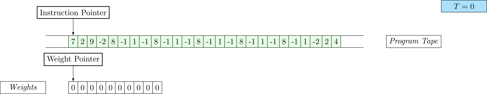
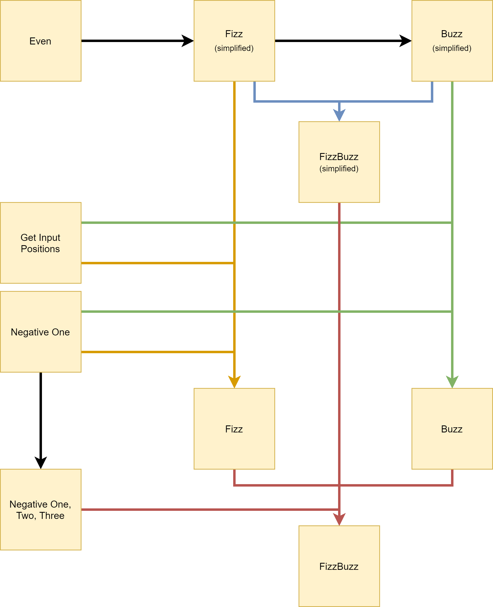

# Levin Search and Curriculum Learning for passing the Coding Interview

[](https://github.com/python/black) 
[](https://www.python.org/download/releases/3.6.0/)

Jelle Piepenbrock and Simon Brugman (equal contribution); January 2020

# TODO: Make clear that counting starts from 1
## Blurb


In our [previous post](part1.md) we discussed Levin Search for finding simple programs that parametrize models. In this post we explore further and move beyond the task described in the paper, by finding a program to print the famous FizzBuzz problem solution. 


## Table of contents

{: class="table-of-content"}
* TOC
{:toc}


### Passing the software interview: the road to FizzBuzz
In this post we move on to problems that were not in the original paper.

FizzBuzz is a well-known children's game centered around division. 
Players sequentially count upwards from 0, but when the number is a multiple of 3 they have to say "Fizz" instead of the number. 
When it is a multiple of five they say "Buzz". 
If the number is divisible by both, they say "FizzBuzz".

Why is this game interesting? The game has been used during coding interviews for hiring programmers, as it is reported that this task is difficult for a majority of entry-level programmers ([[blog 1]](https://imranontech.com/2007/01/24/using-fizzbuzz-to-find-developers-who-grok-coding/), [[blog 2]](https://blog.codinghorror.com/why-cant-programmers-program/).
If you are interested in the history of FizzBuzz for computing, then Tom Scott's [video](https://www.youtube.com/watch?v=QPZ0pIK_wsc) on the topic might interest you.

---

TODO: Joel Grus's satirical job interview log ([[here]](https://joelgrus.com/2016/05/23/fizz-buzz-in-tensorflow/)) does not only entertain, but also demonstrate how gradient descent fails horribly on this task. He trains on the number 101 to 1024 and tests on 1 to 100. A worthwhile mention?

---

In the same way, the Inductive Logic Programming (ILP) community has taken an interest in this task as a benchmark task [[Evans2018]](https://www.jair.org/index.php/jair/article/download/11172/26376/).

Deterministic Levin search purely enumerates programs until the right one is found. 
This bias for simple programs might be justified for tasks for which we believe the solutions are simple.
For a workable approach for more complex programs, the search space will have to be pruned adaptively. 
An idea for training such an adaptive system is curriculum learning: the system would learn to construct programs that teach it skills that generalize to writing more difficult programs, more simply. 
This allows the system to cut down the search space to a manageable size. 
This is the main idea of curriculum learning:

> The idea of training a learning machine with a curriculum can be traced back at least to Elman (1993). 
> The basic idea is to start small, learn easier aspects of the task or easier subtasks, and then gradually increase the difficulty level. [Bengio2009]

While we will not touch upon this adaptive approach in this work, it will be touched upon in the future.  

For now, we will try to get some more insight into the structure of such a curriculum. 
What do we need to be able to program in order to program FizzBuzz? 
Indeed, we initially consider the following tasks can help compress the task of writing a program for FizzBuzz:

- Odd/Even
- Fizz
- Buzz

One of the attractive features of the FizzBuzz curriculum is that it will give us valuable insight in how to set up a system that will be able to compose difficult problems from simpler ones. We are not certain at this point that the solution to FizzBuzz is within reach of this method.

A logical ordering of these tasks, in term of their complexity, is the following: 



_Figure 3: Schematic view on the simplified FizzBuzz task curriculum. Each block denotes a task. Incoming arrows are indicating tasks that have to be mastered. The shortest program generating a solution for even (i.e. $$x mod 2$$) is shorter than that for Fizz ($$x mod 3$$) and Buzz ($$x mod 5$$)._

Let's see what programs for these tasks look like.

### Odd
The task at hand is to print a 1 at every odd index. 
The solution found is of length 6. 
The amount of legal programs of length 6 that we found was 1600, so the chance of printing this program by randomly generating valid programs is $$\frac{1}{1600}$$. 
Be sure to take a look at the GIF to see how the program works.


    
### Even
Here, we're looking for a program that prints a 1 at every even position. We find 4 basically equivalent solutions, of length 8. Note that these programs are much more complicated than the program found for the Odd task. This is due to a combination of the primitives and the setup (0-indexed versus 1-indexed).


   
### Fizz
Fizz is the task of printing a one at every third spot. 
Note that the encoding may be slightly different from what your're imagining: in the context of the children's game, we start counting at 1. 

The length of the solution found is 10 and the space probability of the program is enormously low already. 
While the task seems simple, Fizz is only just within reach of exhaustive Levin search. 
For more interesting programs, smart heuristics are necessary.


       
### Beyond Levin Search: expert design for Buzz and FizzBuzz

Finding Fizz took quite some computation, larger programs as FizzBuzz are not expected to be within reach of this method on a simple machine. 
With some automatic adaptive heuristic, we might be able to cut down on the search space significantly, but this will be in future work.

For now, we can try to design our own programs for Buzz and FizzBuzz and verify whether the solution generalizes. 

If we find such a program, we can use this for an upper bound estimate of the required search time to find the solution with this method. 
Note that there is no guarantee there isn't a shorter program. 
What's interesting to think about is that apparently human programmers can cut the enormous search space enough to find a solution within reasonable time. 
Where does that power come from?

### Constructing a program for Buzz

Finding a program that computes Buzz turned out to be relatively simple, as we already have a solution for Fizz.
If Fizz is `x mod 3`, then Buzz is `x mod 5`.
This translates to simply repeating the second operator, output 0, twice.
The program becomes:

- [7, 1, 1, -1, 1, -1, 1, -1, 1, -1, 1, 1, 2, 2]

The length of this program is 14, which requires at least 4 phases more than Fizz.
The growth of the search space is exponential, hence it is not feasible to find this program on a regular computer. 
However, the structure the solution for Fizz allows an easy extraction of a solution for Buzz. 
Here again, the idea of a curriculum for programming tasks rears its head: how would we create an automated system that is able to spot these easy extensions?

Running:
```console  
python run_program.py string 7,1,1,-1,1,-1,1,-1,1,-1,1,1,2,2 program_buzz.jsonl
```
We see that the program runs for 121 time steps.



### Constructing a program for FizzBuzz

The programs for Fizz and Buzz do nothing more than repeating a pattern of outputs (001 and 00001 respectively).
We can attempt to create a program for FizzBuzz using the same strategy.
The shortest repeating sequence is of length 15 (001021001201003, 1=Fizz, 2=Buzz, 3=FizzBuzz).
Based on this strategy we can construct the following program:

- [7, 2, 5, 3, -2, 1, -1, 1, -1, 1, 5, 1, -1, 1, 1, 1, 5, 1, -1, 1, -1, 1, 5, 1, 1, 1, -1, 1, 5, 1, -1, 1, -1, 1, 3, 2, 5]

The program is of length 37 (the search space for programs of length 37 is absolutely, positively gigantic, how do human programmers do this?). 
The first 5 cells are used to load the values that are necessary for the output (0, 1, 2, 3).
The 30 following cells are all `ouput address` instructions.
Then the last instruction is a jump to address 5.

Systematically:

$$\underbrace{7, 2, 5, 3, -2,}_{\text{load}} \space \underbrace{1, -1, 1, -1, 1, 5, 1, -1, 1, 1, 1, 5, 1, -1, 1, -1, 1, 5, 1, 1, 1, -1, 1, 5, 1, -1, 1, -1, 1, 3,}_{\text{output}} \space \underbrace{2, 5}_{\text{repeat}}$$

Running:
```console  
python run_program.py string 7,2,5,3,-2,1,-1,1,-1,1,5,1,-1,1,1,1,5,1,-1,1,-1,1,5,1,1,1,-1,1,5,1,-1,1,-1,1,3,2,5 program_fizzbuzz.jsonl
```

We see that the program runs for 108 time steps.




### Increasing the difficulty: Complete Encoding

You might have noticed that the encoding of our problem until now was not exactly like the FizzBuzz game. 
We allowed a simplified encoding where the program prints 0s at positions where children would have to say the number.
In other words, the simplified encoding prints "0 0 Fizz 0 Buzz", while it would be more accurate to have "1, 2, Fizz, 4, Buzz". 
As a result, solutions where simpler, in line with our curriculum approach.
Now, we are moving on to the complete encoding: The program will have to print "1, 2, -1, 4, -2" and so on.

To make this more clear, here are the encodings as they were:

Simplified encoding:

| Task      | Encoding                          |
|-----------|-----------------------------------|
| Fizz      | 0 0 1 0 0 1 0 0 1 0 0 1 0 0 1 ... |
| Buzz      | 0 0 0 0 1 0 0 0 0 1 0 0 0 0 1 ... |
| FizzBuzz  | 0 0 1 0 2 1 0 0 1 2 0 1 0 0 3 ... |

Besides, we have seen the encoding for adding input positions:

| Task      | Encoding                                |
|-----------|-----------------------------------------|
| Position  | 1 2 3 4 5 6 7 8 9 10 11 12 13 14 15 ... |

These encodings can be composed to the following complete task encodings:

| Task      | Encoding                                |
|-----------|-----------------------------------------|
| Fizz      | 1 2 -1 4 5 -1 7 8 -1 10 11 -1 13 14 -1  |
| Buzz      | 1 2 3 4 -1 6 7 8 9 -1 11 12 13 14 -1    |
| FizzBuzz  | 1 2 -1 4 -2 -1 7 8 -1 -2 11 -1 13 14 -3 |

Figure 4 clarifies the relations between the task encodings.




_Figure 4: Schematic view on the full FizzBuzz task curriculum. Each block denotes a task. Incoming arrows are indicating tasks that have to be mastered. Arrow colors are merely contrastive._
 
### Fizz revised

Where Fizz in it's simplified encoding was just withing the reach of our method, the complete encoding is far out in program space.
However, we can leverage our curriculum.
Previously, we found solutions for:
- Adding input positions: [7, 1, 8, -1, 1, -1, 2, 2]
- Simplified Fizz: [7, 1, 1, -1, 1, -1, 1, 1, 2, 2]

Let's get started.
Human programmers have the powerful ability to spot patterns from a low number of examples, as above.
The decisive observations are that (1) both sequences contain a non-recurring and recurring part and (2) the programs need to be interleaved (in the ratio 2:1).

TODO Explanation will be simpler if the solution starts with the Simplified Fizz program, and then replaces all 0 values in the encoding with the adding input positions value. Interleaving is confusing.

Programmatically, interleaving means concatenating the non-recurring prefixes ([7 1] in both programs, i.e. allocate one work tape cell) and selecting one OUTPUT instruction from the recurring part.
The input position program contributes [8, -1, 1, -1] twice, i.e. increase the position and output the position.
Then the Fizz program adds [1, 1], i.e. output 1.

- [7 1 7 1 8 -1 1 -1 8 -1 1 -1 1 1 2 4]

Blindly combining the two programs in the logical proportions leaves us with the following output:
 
- [1 2 1 3 4 1 5 6 1 7 8 1 9 10 1 ...]

With the learned "skills" (the solutions in the curriculum), a programmer is able to construct a program that nearly does as expected.
What's missing? Whereas the program prints 1, the new encoding expects -1 to encode Fizz, to not clash with the first position.
The skill to print -1 was not in the curriculum, but one can easily see that the program is so simple that it's within reach of both levin search and the programmer.
We hypothesise the programs starting with: [7, 1, 9, -1]

Adding the [NEGATIVE ONE](images/negative_one/) task for 8 phases finds us four solutions with all equal run time (203 steps) and space probabilities:

- [7, 1, 8, -1, 1, 3, 2, 4]
- [7, 1, 9, -1, 1, -1, 2, 4]
- [7, 1, 9, -1, 1, 3, 2, 4]
- [7, 1, 11, 5, 1, -1, 2, 4]

For completeness, we add this task to the curriculum which you will see later.
We now move one with constructing the program.

Program for the full encoding:
- [7,1,7,1,9,-2,8,-1,1,-1,8,-1,1,-1,8,-1,1,-2,2,6] (length=20, time steps=237)

The program can be simplified combining the two allocation instructions:

- [7,2,9,-2,8,-1,1,-1,8,-1,1,-1,8,-1,1,-2,2,4] (length=18, time steps=236)

Test:
```
python run_program.py --n_weights 100 string 7,2,9,-2,8,-1,1,-1,8,-1,1,-1,8,-1,1,-2,2,4 program_fizz_full.jsonl
```




### Buzz revised

The same strategy applies for finding a solution for Buzz as for Fizz: we list the solutions to problems in the curriculum.

The human programmer implicitly selects the solutions that seem relevant, in this case these are all with the exception of the position solution (why?):
- Fizz (compact): [7, 1, 1, -1, 1, -1, 1, 1, 2, 2]
- Buzz (compact): [7, 1, 1, -1, 1, -1, 1, -1, 1, -1, 1, 1, 2, 2]
- Fizz (complete): [7, 2, 9, -2, 8, -1, 1, -1, 8, -1, 1, -1, 8, -1, 1, -2, 2, 4]
- Negative one: [7, 1, 9, -1, 1, 3, 2, 4]

The programmer knows to search for the Buzz (complete) program per analogy, by filling in:
The compact encoding of Fizz is to that of Buzz as the complete encoding of Fizz is of that to Buzz.
We have seen that to construct the compact Buzz program, partial subroutines of Fizz were repeated. 
Hence, the algorithmically related transformation is expected to provide an solution for the complete encoding of Buzz, when applied to the complete encoding of Fizz. 
In that case, we repeat the output and increment (which is a partially analogous skill, with shared algorithmic information [Schmidhuber2018]).

- Solution to Buzz (full): [7, 2, 9, -2, 8, -1, 1, -1, 8, -1, 1, -1, 8, -1, 1, -1, 8, -1, 1, -1, 8, -1, 1, -2, 2, 4] (length=26, time steps=223)

Test:
```
python run_program.py --n_weights 100 string 7,2,9,-2,8,-1,1,-1,8,-1,1,-1,8,-1,1,-1,8,-1,1,-1,8,-1,1,-2,2,4 program_buzz_full.jsonl
```




### FizzBuzz revised

Altogether, these solutions are known:
- Fizz (compact): [7, 1, 1, -1, 1, -1, 1, 1, 2, 2]
- Buzz (compact): [7, 1, 1, -1, 1, -1, 1, -1, 1, -1, 1, 1, 2, 2]
- FizzBuzz (compact): [7, 2, 5, 3, -2, 1, -1, 1, -1, 1, 5, 1, -1, 1, 1, 1, 5, 1, -1, 1, -1, 1, 5, 1, 1, 1, -1, 1, 5, 1, -1, 1, -1, 1, 3, 2, 5]
- Fizz (complete): [7, 2, 9, -2, 8, -1, 1, -1, 8, -1, 1, -1, 8, -1, 1, -2, 2, 4] 
- Buzz (complete): [7, 2, 9, -2, 8, -1, 1, -1, 8, -1, 1, -1, 8, -1, 1, -1, 8, -1, 1, -1, 8, -1, 1, -2, 2, 4]
- Negative one: [7, 1, 9, -1, 1, 3, 2, 4]

The complete FizzBuzz encoding is the first to require to print the values -2 and -3.
On the whole, we need to have pointers to the values -1, -2, -3 and to a position counter.
There is no one solution, the negative one task demonstrates four alternative ways to print -1 with the same complexity. 
 
A strategy could be allocates two cells on the work tape and accesses it's positions (-1 and -2).
We can decrease one of the work tape cell's values three times to also obtain the pointer to (-3).
The remaining work tape cell is use as the position counter.

Solution to FizzBuzz (full):

| Substructure              | Interpretation                        |
|---------------------------|---------------------------------------|
| 7, 2, 9, -2, 9, -2, 9, -2 | Allocate memory, load pointers        |
| 8, -1                     | Increase the position counter         |
| 1, -1                     | Output the position counter           |     
| 8, -1                     | Increase the position counter         |
| 1, -1                     | Output the position counter           |     
| 8, -1                     | Increase the position counter         |
| 1, 9                      | Output -1 (Fizz)                      |       
| 8, -1                     | Increase the position counter         |
| 1, -1                     | Output the position counter           |    
| 8, -1                     | Increase the position counter         |
| 1, 3                      | Output -2 (Buzz)                      |
| 8, -1                     | Increase the position counter         |
| 1, 9                      | Output -1 (Fizz)                      |    
| 8, -1                     | Increase the position counter         |
| 1, -1                     | Output the position counter           |   
| 8, -1                     | Increase the position counter         |
| 1, -1                     | Output the position counter           |     
| 8, -1                     | Increase the position counter         |
| 1, 9                      | Output -1 (Fizz)                      |         
| 8, -1                     | Increase the position counter         |
| 1, 3                      | Output -2 (Buzz)                      |
| 8, -1                     | Increase the position counter         |
| 1, -1                     | Output the position counter           |   
| 8, -1                     | Increase the position counter         |
| 1, 9                      | Output -1 (Fizz)                      |  
| 8, -1                     | Increase the position counter         |
| 1, -1                     | Output the position counter           |   
| 8, -1                     | Increase the position counter         |
| 1, -1                     | Output the position counter           |   
| 8, -1                     | Increase the position counter         |
| 1, -2                     | Output -3 (FizzBuzz)                  |  
| 2, 8                      | Jump back to position 8 (i.e. repeat) | 

Program:
- [7, 2, 9, -2, 9, -2, 9, -2, 8, -1, 1, -1, 8, -1, 1, -1, 8, -1, 1, 9, 8, -1, 1, -1, 8, -1, 1, 3, 8, -1, 1, 9, 8, -1, 1, -1, 8, -1, 1, -1, 8, -1, 1, 9, 8, -1, 1, 3, 8, -1, 1, -1, 8, -1, 1, 9, 8, -1, 1, -1, 8, -1, 1, -1, 8, -1, 1, -2, 2, 8] (length=70)

OUTPUT -1 (value: Position)
OUTPUT 9 (value: -1)
OUTPUT 3 (value: -2)
OUTPUT -2 (value: -3)


Test:
```
python run_program.py --n_weights 50 string 7,2,9,-2,9,-2,9,-2,8,-1,1,-1,8,-1,1,-1,8,-1,1,9,8,-1,1,-1,8,-1,1,3,8,-1,1,9,8,-1,1,-1,8,-1,1,-1,8,-1,1,9,8,-1,1,3,8,-1,1,-1,8,-1,1,9,8,-1,1,-1,8,-1,1,-1,8,-1,1,-2,2,8 program_fizzbuzz_full.jsonl
```


### The full curriculum



_Figure 5: Schematic view on the extended FizzBuzz task curriculum._
 

### Discussion / Analysis of results on the FizzBuzz Curriculum 

(Composition)
Fizz, Buzz and FizzBuzz all three repeat strings of length 3, 5 and 15 respectively in the current encoding.

Note that the levin complexity of the length 70 program is expected to be lower due to the recurring code.
Simple way to see that is by updating the primitives.

"Skills" that may seem trivial (e.g. printing -1 when we already have a program printing 1), don't have to be.
In our example printing -1 requires additional primitives.
When the curriculum adequately covers the skills required, adaptive algorithms can use prior solutions to filter the search space (e.g. putting lower probability on unseen primitives).

(Shared algorithmic information)
In the complete encoding for Buzz we have seen the power of partial analoguous programs, where programs are generated with shared algorithmic information.

> "This forces ONE to relate partially analogous skills (with shared algorithmic information) to each other, creating common subroutines in form of shared subnetworks of ONE, to greatly speed up subsequent learning of additional, novel but algorithmically related skills"
[Schmidhuber2018]

## Attribution

Cited as:
```bibtex
@article{authors2020title,
  title   = "Title",
  author  = "Piepenbrock, Jelle and Brugman, Simon",
  journal = "simonbrugman.nl",
  year    = "2020",
  url     = "https://simonbrugman.nl/title"
}
```

This blog is cross-published at both author's blogs. You can find the parallel version [here](#).

## References
- Elman, J. L. (1993). Learning and development in neural networks: The importance of starting small. Cognition, 48(1), 71-99.
- Schmidhuber, J. (1997). Discovering neural nets with low Kolmogorov complexity and high generalization capability. Neural Networks, 10(5), 857-873.
- Bengio, Y., Louradour, J., Collobert, R., & Weston, J. (2009). Curriculum learning. In Proceedings of the 26th annual international conference on machine learning (pp. 41-48).
- Schmidhuber, J. (2018). One big net for everything. arXiv preprint arXiv:1802.08864.
- Evans, R., & Grefenstette, E. (2018). Learning explanatory rules from noisy data. Journal of Artificial Intelligence Research, 61, 1-64.
